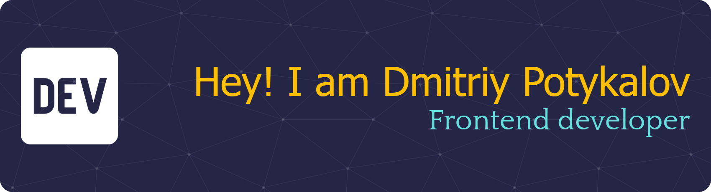

Привет! 👋 Я Дмитрий Потыкалов
==========================================================================================================================================

Frontend Developer
------------------

Изучаю фронтенд разработку, чтобы сменить профессию.

* 🧠  В настоящее время изучаю фронтенд-разработку на курсе ["Фронтенд-разработчик: расширенный курс"](https://netology.ru/programs/front-end-basic#/) (03.11.2025 - 12.03.2027) в Нетологии и создаю портфолио-проекты.
* 💼  Ищу работу и интересные проекты для портфолио.

## Languages and Tools

## Программы

## Сертификаты Нетологии

- [HTML-верстка: с нуля до первого макета (03.11.2025 - 05.12.2025)](./images/html-css-layout-certificate.pdf)
- [Адаптивная и мобильная верстка (12.12.2025 - 02.02.2026)](./images/responsive-web-design.pdf)
- [Основы программирования (09.02.2026 - 16.03.2026)](./images/programming-basics.pdf)
- [Git — система контроля версий (23.03.2026 - 06.04.2026)](./images/git-version-control.pdf)

## Контакты

<!--
**Potykalov/Potykalov** is a ✨ _special_ ✨ repository because its `README.md` (this file) appears on your GitHub profile.

Here are some ideas to get you started:

- 🔭 I’m currently working on ...
- 🌱 I’m currently learning ...
- 👯 I’m looking to collaborate on ...
- 🤔 I’m looking for help with ...
- 💬 Ask me about ...
- 📫 How to reach me: ...
- 😄 Pronouns: ...
- ⚡ Fun fact: ...
-->
